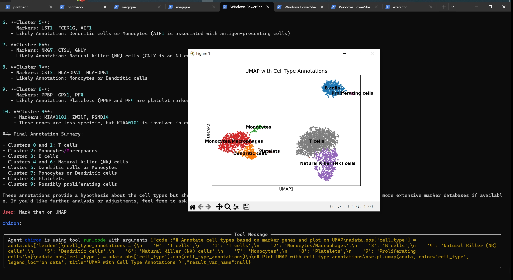

# Pantheon Single-cell agent

This is a demo of using Pantheon to build a single-cell RNA-seq data analysis agent.


## Run the demo

Install the dependencies:

```bash
$ pip install pantheon-agents[tool]>=0.1.5 scanpy[leiden]
```

Start the agent for chat:

```bash
export OPENAI_API_KEY=<your_openai_api_key>
python agent.py
```



## Define your agent

An agent is defined by setting the `instructions` and `toolset` in the `agent.py` file:

```python
import asyncio

from pantheon.agent import Agent
from pantheon.tools.python import PythonInterpreterToolSet
from pantheon.remote import run_toolsets

instructions = """You are a AI-agent for analyzing single-cell RNA-seq data.

Given a single-cell RNA-seq dataset,

you can write python code call scanpy package to analyze the data.

Basicly, given a single-cell RNA-seq dataset in h5ad / 10x format or other formats,
you should firstly output your plan and the code.
Then, you should execute the code to read the data,
then preprocess the data, and cluster the data, and finally visualize the data.
"""

toolset = PythonInterpreterToolSet("scanpy-python-interpreter")

agent = Agent(
    name="chiron",
    instructions=instructions,
    model="gpt-4o",
)

async def main():
    async with run_toolsets([toolset]):
        await agent.remote_toolset(toolset.service_id)
        await agent.chat()

```

### Toolset

The toolset is a set of tools that the agent can use. We provide two built-in toolsets:

- `PythonInterpreterToolSet`: a toolset for executing python code, can be imported from `pantheon.tools.code_execution`.
- `WebBrowseToolSet`: a toolset for browsing the web, can be imported from `pantheon.tools.web_browse`.

You can also define your own toolset by implementing the `ToolSet` interface.
For example:

```python
from functools import wraps
from pantheon.remote import ToolSet, tool


class MyToolSet(ToolSet):
    @tool
    async def my_tool(
            self,
        ):
        print("my tool is called")
```

### Run toolset independently

The pantheon-agents is designed to be used in a distributed environment,
but you can also run the toolset independently. For example,
run the `PythonInterpreterToolSet` independently:

```bash
python -m pantheon.tools.code_execution my_python_interpreter
```

You can also run the `WebBrowseToolSet` independently:

```bash
python -m pantheon.tools.web_browse my_web_browse
```

Then you will get the toolset service id and name, you can use it in the agent.

```python
async def main():
    await agent.remote_toolset("my_python_interpreter")
    await agent.remote_toolset("my_web_browse")
    await agent.chat()
```
